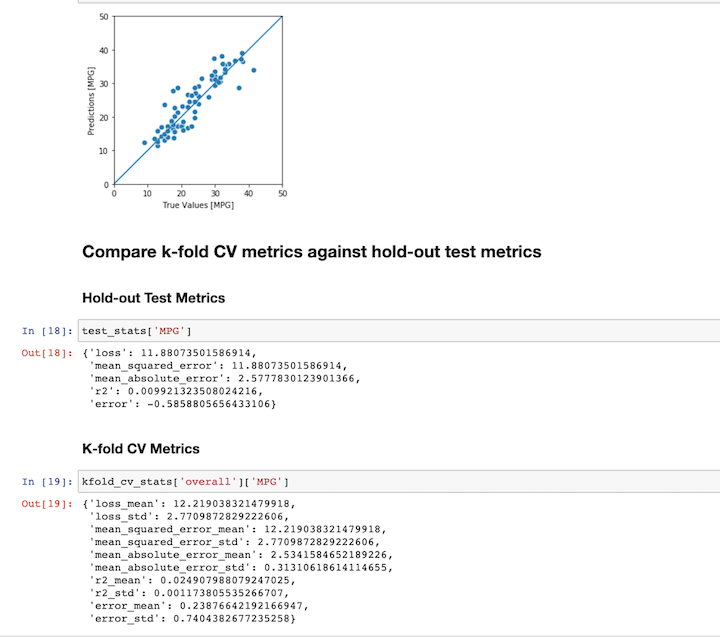

# K-Ffold Cross Validation Example

This directory contains two examples of performing a k-fold cross validation analysis with Ludwig.

## Classification Example
This example illustrates running the k-fold cv with the `ludwig experiment` cli.

To run this example execute this bash script:
``` 
./k-fold_cv_classification.sh
```
This bash script performs these steps:
* Download and prepare data for training and create a Ludwig model definition file
* Execute `ludwgig experiment` to run the 5-fold cross validation
* Display results from the 5-fold cross validation analysis

Sample output:
``` 
Cleaning out old results
Downloading data set
Preparing data for training
Saving training and test data sets
Preparing Ludwig model definition
Completed data preparation
WARNING:tensorflow:
The TensorFlow contrib module will not be included in TensorFlow 2.0.
For more information, please see:
  * https://github.com/tensorflow/community/blob/master/rfcs/20180907-contrib-sunset.md
  * https://github.com/tensorflow/addons
  * https://github.com/tensorflow/io (for I/O related ops)
If you depend on functionality not listed there, please file an issue.

WARNING:tensorflow:From /opt/project/ludwig/features/binary_feature.py:194: calling weighted_cross_entropy_with_logits (from tensorflow.python.ops.nn_impl) with targets is deprecated and will be removed in a future version.
Instructions for updating:
targets is deprecated, use labels instead
WARNING:tensorflow:From /opt/project/ludwig/utils/tf_utils.py:78: The name tf.GPUOptions is deprecated. Please use tf.compat.v1.GPUOptions instead.

2020-02-10 03:49:28.155819: I tensorflow/core/platform/cpu_feature_guard.cc:142] Your CPU supports instructions that this TensorFlow binary was not compiled to use: AVX2 FMA
2020-02-10 03:49:28.161741: I tensorflow/core/platform/profile_utils/cpu_utils.cc:94] CPU Frequency: 2791505000 Hz
2020-02-10 03:49:28.161958: I tensorflow/compiler/xla/service/service.cc:168] XLA service 0x5e65cb0 initialized for platform Host (this does not guarantee that XLA will be used). Devices:
2020-02-10 03:49:28.161999: I tensorflow/compiler/xla/service/service.cc:176]   StreamExecutor device (0): Host, Default Version
Training: 100%|████████████████████████████████████████████████████████████████████████████████| 12/12 [00:00<00:00, 23.14it/s]
Evaluation train: 100%|████████████████████████████████████████████████████████████████████████| 12/12 [00:00<00:00, 98.62it/s]
Evaluation test : 100%|█████████████████████████████████████████████████████████████████████████| 3/3 [00:00<00:00, 321.03it/s]
Training: 100%|███████████████████████████████████████████████████████████████████████████████| 12/12 [00:00<00:00, 190.18it/s]
Evaluation train: 100%|███████████████████████████████████████████████████████████████████████| 12/12 [00:00<00:00, 331.68it/s]
Evaluation test : 100%|█████████████████████████████████████████████████████████████████████████| 3/3 [00:00<00:00, 298.08it/s]
<<<< DELETED LINES >>>>>
Training: 100%|███████████████████████████████████████████████████████████████████████████████| 12/12 [00:00<00:00, 248.00it/s]
Evaluation train: 100%|███████████████████████████████████████████████████████████████████████| 12/12 [00:00<00:00, 400.31it/s]
Evaluation test : 100%|█████████████████████████████████████████████████████████████████████████| 3/3 [00:00<00:00, 340.35it/s]
Evaluation: 100%|████████████████████████████████████████████████████████████████████████████████| 3/3 [00:00<00:00, 27.87it/s]
retrieving results from  results
#
# K-fold Cross Validation Results
#
{'combined': {'accuracy_mean': 0.9736263736263737,
              'accuracy_std': 0.011206636293610508,
              'loss_mean': 0.06359774886251807,
              'loss_std': 0.011785678840394689},
 'diagnosis': {'accuracy_mean': 0.9736263736263737,
               'accuracy_std': 0.011206636293610508,
               'average_precision_macro_mean': 0.995842104045726,
               'average_precision_macro_std': 0.002339014329647542,
               'average_precision_micro_mean': 0.995842104045726,
               'average_precision_micro_std': 0.002339014329647542,
               'average_precision_samples_mean': 0.995842104045726,
               'average_precision_samples_std': 0.002339014329647542,
               'loss_mean': 0.06359774886251807,
               'loss_std': 0.011785678840394689,
               'roc_auc_macro_mean': 0.9973999160508542,
               'roc_auc_macro_std': 0.0011259319854886507,
               'roc_auc_micro_mean': 0.9973999160508542,
               'roc_auc_micro_std': 0.0011259319854886507}}
```


## Regression Example
This illustrates using the Ludwig API to run the k-fold cross validation analysis.  To run the example, open the jupyter notebook `regression_example.ipynb`.

Expected output from running the example:
