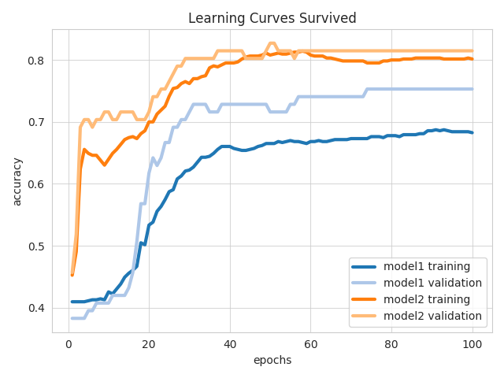

# Kaggle Titanic Survivor Prediction

This API example is based on [Ludwig's Kaggle Titanic example](https://uber.github.io/ludwig/examples/#kaggles-titanic-predicting-survivors) for predicting probability of surviving. 

### Preparatory Steps
* Create `data` directory
* Download [Kaggle competition dataset](https://www.kaggle.com/c/titanic/data) into the `data` directory.  Directory should
appear as follows:
```
titanic/
    data/
        train.csv
        test.csv
```

### Examples
|File|Description|
|----|-----------|
|simple_model_training.py|Demonstrates using Ludwig api for training a model.|
|multiple_model_training.py|Trains two models and generates a visualization for results of training.|
|model_training_results.ipynb||

### Executing the examples

Enter `python simple_model_training.py` will generate model training results 
```
./results/
    simple_experiment_simple_model/
```

Enter `python multiple_model_training.py` will evaluate two models and places training results and visualizations in the following directories:
``` 
./results/
    multiple_model_model1/
    multiple_model_model2/
./visualizations/
    learning_curves_Survived_accuracy.png
    learning_curves_Survived_loss.png
```
 
 This will generate a learning curve plot from training the two models
 